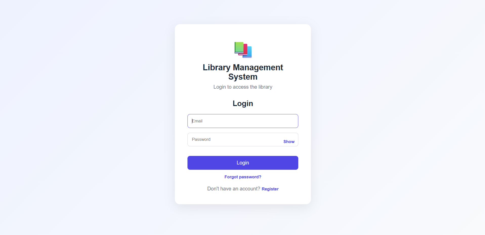
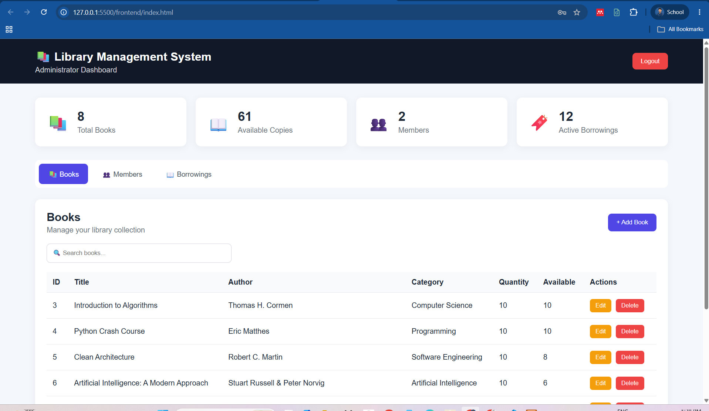
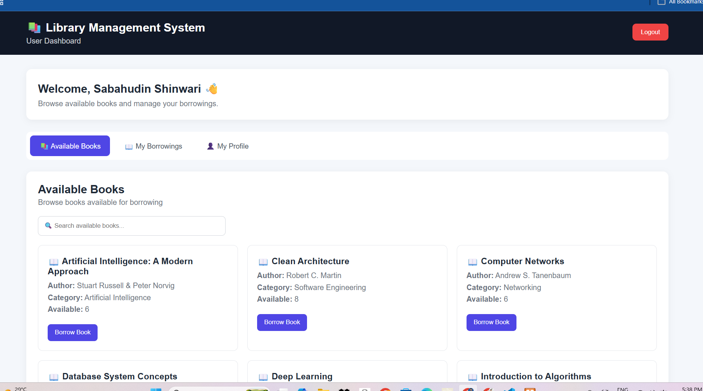

# Library Management System

A full-stack Library Management System developed during my Full Stack Development Internship at DecodeLabs. The system includes user authentication, book management, borrowing management, database integration, and RESTful API development.

## 📸 Screenshots

### Login Page


### Admin Dashboard


### User Dashboard


## Technologies Used

### Frontend

- HTML5
- CSS3
- JavaScript

### Backend

- Node.js
- Express.js
- REST API

### Database

- MySQL

## Features

- User authentication and login system
- Password reset through email
- Add, view, update, and delete members
- Borrow books
- Return books
- Automatic available-book quantity management
- Borrowing history
- Search books and members
- Dashboard statistics
- RESTful API
- Database transactions
- Input validation and error handling
- Responsive user interface

## Project Structure

```text
Project3_Library_Management_System/
│
├── backend/
│   ├── config/
│   ├── controllers/
│   ├── models/
│   ├── routes/
│   ├── server.js
│   ├── package.json
│   └── package-lock.json
│
├── frontend/
│   ├── index.html
│   ├── style.css
│   └── script.js
│
├── screenshots/
│   ├── login.png
│   ├── admin_dashboard.png
│   └── user_dashboard.png
│
├── .gitignore
└── README.md 
```

## API Endpoints

### Books

- GET `/api/books`
- GET `/api/books/:id`
- POST `/api/books`
- PUT `/api/books/:id`
- DELETE `/api/books/:id`

### Members

- GET `/api/members`
- GET `/api/members/:id`
- POST `/api/members`
- PUT `/api/members/:id`
- DELETE `/api/members/:id`

### Borrowings

- GET `/api/borrowings`
- GET `/api/borrowings/:id`
- POST `/api/borrowings`
- PUT `/api/borrowings/:id/return`

## Password Reset Email Setup

Password reset links are sent through Gmail. Create a Gmail app password, then create `backend/.env` with:

```env
GMAIL_USER=your-gmail-address@gmail.com
GMAIL_APP_PASSWORD=your-16-character-gmail-app-password
RESET_FRONTEND_URL=http://127.0.0.1:5500/frontend/index.html
```

## Author

Sabahudin Shinwari

Computer Science Student  
Albukhary International University